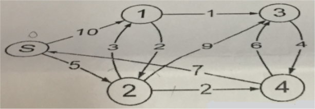

## Parcial 2: noviembre 2016


# Ej 1

Dado un arbol binario que proviene de la transformación de un arbol general, desarrollar una función int
que verifique si en el arbol general existía algun nodo de grado 2 tal que las claves de sus hijos eran iguales 
u opuestas.

- Mostrar la invocación de la solucion desarrollada


```c

int abs(int a) {
	return (a > 0 ? a : -a);
}

int arbol_verifica(Arbol a) {
	int encontrado = 0;
	if (a && a->der && !a->der->der && (abs(a->dato) == abs(a->der->dato))) { 
		//es grado 2 y las claves son opuestas o iguales
		return 1;
	} else { // No es grado 2, sigo buscando
		while (a && !encontrado) {
			
			/* Normalmente metería un return acá mismo, pero como soy un buen samaritano que sigue los 
			principios y doctrinas de la programación estructurada, entonces uso una banderita (encontrado)
			para decidir cuándo salir del while */
			if (a->izq)
				encontrado = arbol_verifica(a->izq);
			
			a = a->der;
		}
		return encontrado;
	}
}

int main() {

	// Crea el arbol a
	
	int verifica = arbol_verifica(a);

	return 0;
}


```


# Ej 2

(Utilizar TDA N-Ario) Dado un arbol N-Ario de claves reales, obtener la suma de las 
claves de los nodos cuyo nivel pertenece al intervalo cerrado [K1, K2]. 

- Mostrar la invocación de la solucion desarrollada
- K1 y K2 son datos de entrada

```c

float arbol_suma(Arbol a, Posicion p, int k1, int k2, int nivel) {

	if (nivel < k1) { // no llegamos al nivel
		// Pro: menos bucles, más fácil de leer
		// Contra: más invocaciones a la función recursiva
		return arbol_suma(a, HijoMasIzq(a, p), k1, k2, nivel + 1) 
			+ arbol_suma(a, HermanoDer(a, p), k1, k2, nivel);
	} else if (nivel > k2) { // nos pasamos del nivel
		return 0; // No suma ni llama recursivamente! 
	} else { // Estamos en el rango
		//Sumemos! 
		return (Info(a, p))
			+ arbol_suma(a, HijoMasIzq(a, p), k1, k2, nivel + 1) 
			+ arbol_suma(a, HermanoDer(a, p), k1, k2, nivel);
	}
}

int main() {

	// Crea el arbol a y las variables k1, k2
	
	float suma = arbol_suma(a, Raiz(a), k1, k2, 1);

	return 0;
}

```


# Ej 3

Dado un grafo almacenado en media matriz de adyacencia (triangulo inferior), generar mediante
una función void recursiva, un arreglo con el grado de cada uno de sus vertices.

- Mostrar la invocación de la solucion desarrollada
- La función recursiva no debe contener ciclos


```c

#DEFINE MAX_VERTICES 10

typedef int Matriz[MAX_VERTICES, MAX_VERTICES];
typedef int Arreglo[MAX_VERTICES];

void grafo_vertice_grado(Matriz mat, Arreglo grado, int n, int vertice, int i) {
	if (vertice < n) {
		if (i < n) {
			grado[vertice] += (vertice < i ? mat[vertice][i] : mat[i][vertice]);
			grafo_vertice_grado(mat, grado, n, vertice + 1, 0);
		} else {
			grafo_vertice_grado(mat, grado, n, vertice, i + 1);
		}
	}	
}

void main() {
	Matriz mat = {
		{0, 0, 0, 0, 0},
		{1, 0, 0, 0, 0},
		{0, 1, 0, 0, 0},
		{1, 1, 1, 0, 0},
		{0, 0, 0, 1, 0},
	}
	
	Arreglo grado = {0};
	
	int n = 5; 
	
	grafo_tri_grado(mat, grado, n, 0, 0);

}

```

# Ej 4

Encontrar el costo minimo de una fuente a todos los nodos del grafo. Indicar el algoritmo utilizado y 
mostrar su ejecución paso a paso. 



Algoritmo: Dijkstra

(En lugar de 1, 2, 3, 4 se nombran a los vertices como A, B, C, D para evitar confusiones)

|Vert actual  |S   |A     |B     |C     |D     |Visitados   |VRecorrido     |
|------------:|----|------|------|------|------|------------|---------------|
|S            |-   |10(S) |5(S)  |INF   |INF   |{S}         |{S,S,S,0,0}    |
|B            |-   |8(B)  |-     |14(B) |7(B)  |{S,B}       |{S,B,S,B,B}    |
|D            |-   |8(B)  |-     |13(D) |-     |{S,B,D}     |{S,B,S,D,B}    |
|A            |-   |-     |-     |10(A) |-     |{S,B,D,A}   |{S,B,S,A,B}    |
|C            |-   |-     |-     |-     |-     |{S,B,D,A,C} |{S,B,S,A,B}    |
|COSTO:       |0   |8     |5     |10    |7     |            |               |


